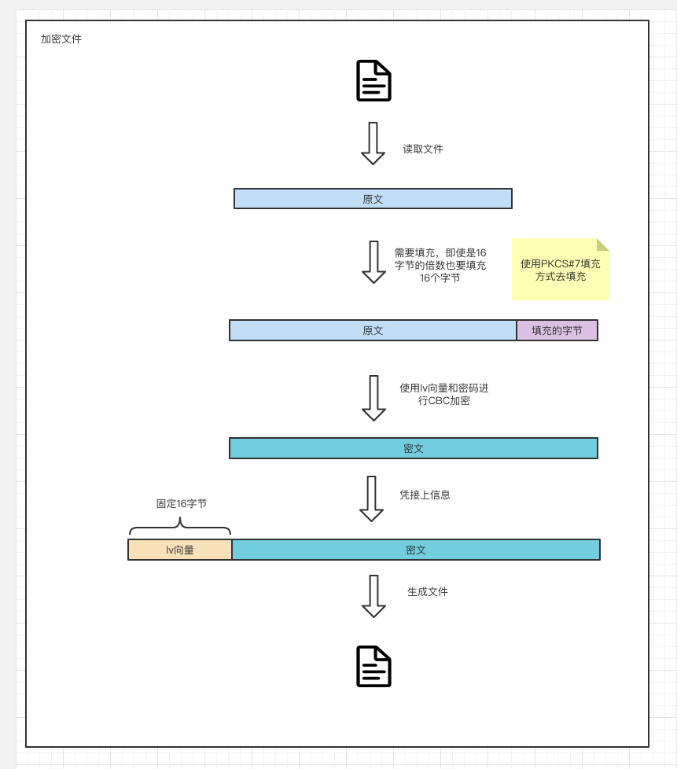
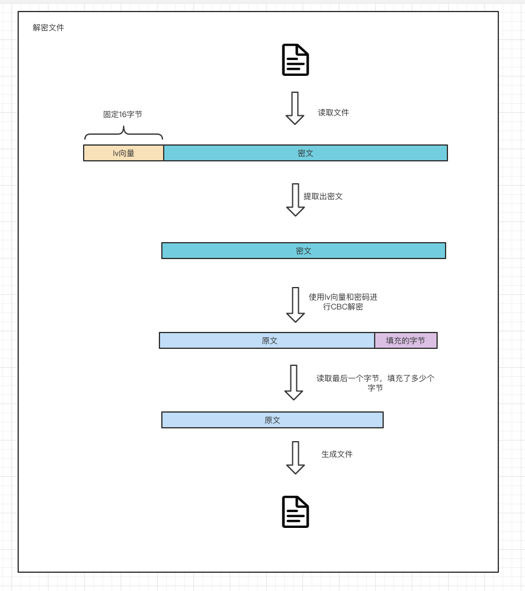

# aes-cbc-encrypt-file
> 使用aes对称加密算法加密文件demo
- 工作模式：密码块链接（CBC）、最常用的工作模式，在第一个块中使用初始化向量(理解为随机数)进行异或，每个明文块先与前一个密文块进行异或后，再进行加密。
- 填充算法：缺几个字节就填几个缺的字节数
```
... | DD DD DD DD DD DD DD DD | DD DD DD DD 04 04 04 04 |
```

### 原理
#### 加密逻辑


#### 解密逻辑


### 使用
加密
```
go run main.go --e text.pdf
```

解密
```
go run main.go --d 4444.pdf.enc
```